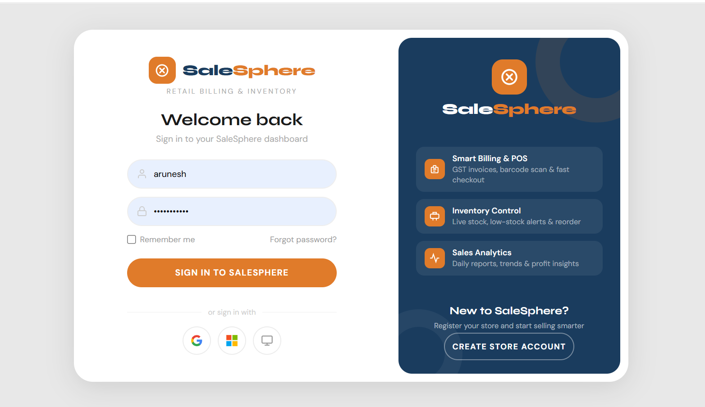
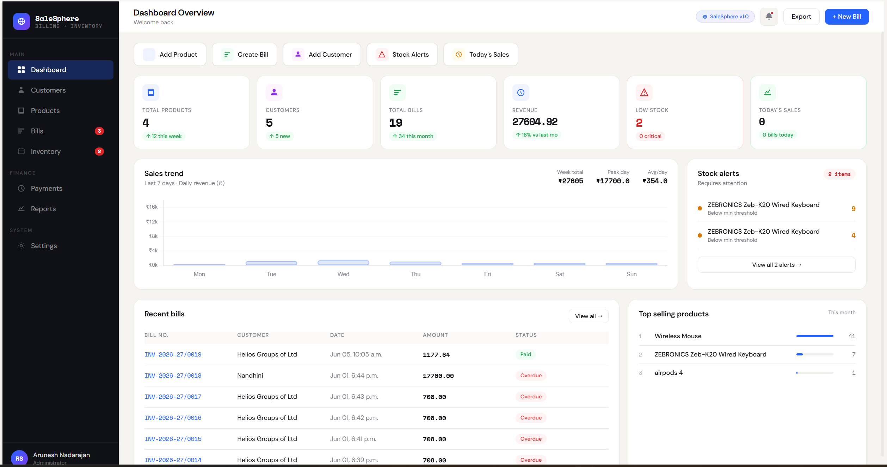
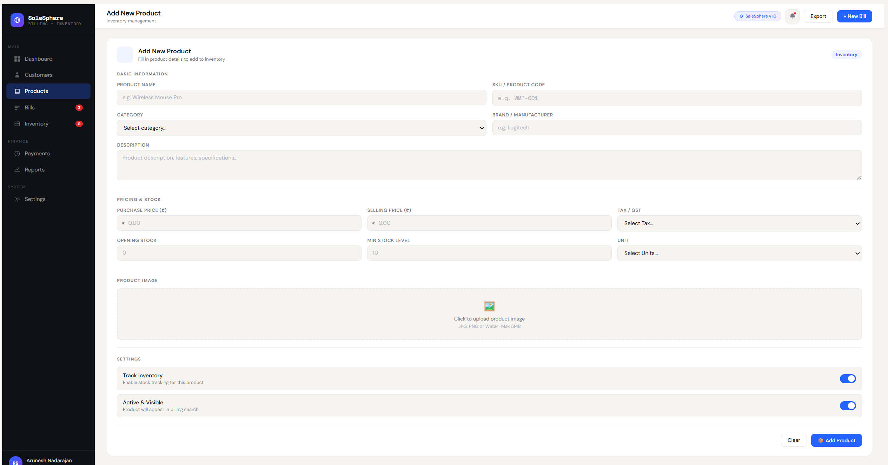
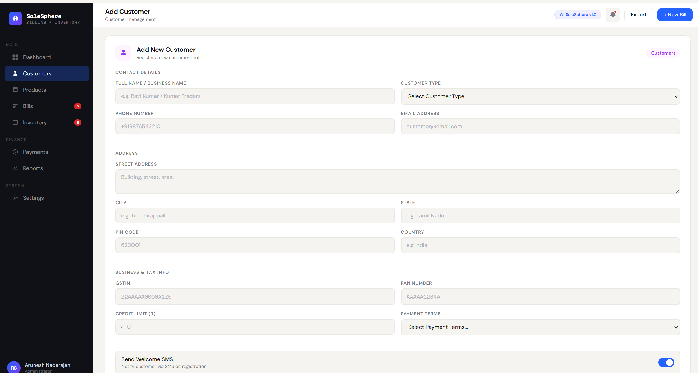
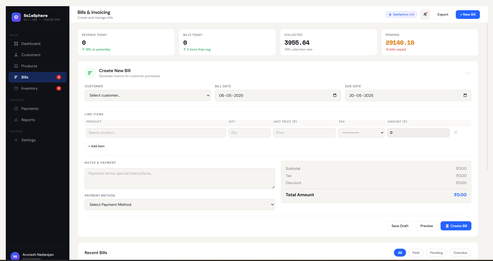
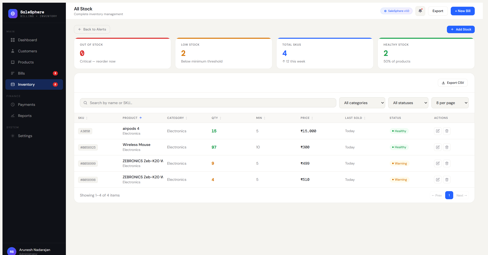
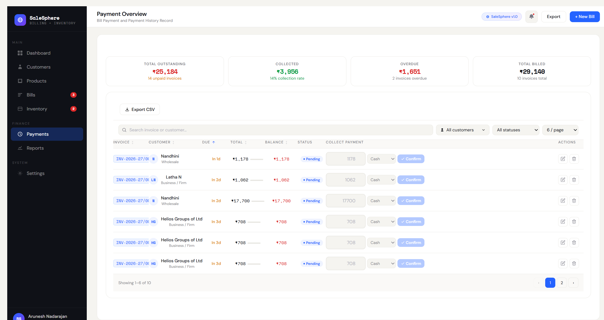

# Salesphere

<<<<<<< HEAD
Salesphere is a Django-based Store Management and Billing System designed for small and medium-sized businesses. It helps store owners manage products, customers, inventory, invoices, payments, and business operations from a centralized dashboard.

---

## Features

### Store Management
- Store registration during signup
- Business category selection
- GST information management
- Store profile management

### User Authentication
- User Registration
- Secure Login
- Logout Functionality
- Session-based Authentication
- Protected Dashboard Access

### Product Management
- Add Products
- Update Product Details
- Delete Products
- Product Categories
- Product Branding
- GST Tax Configuration
- Stock Management
- Unit Management (PCS, KG, Litre, Box, Pack)

### Inventory Management
- Opening Stock Tracking
- Current Stock Tracking
- Minimum Stock Alerts
- Stock Updates
- Inventory Monitoring

### Customer Management
- Add Customers
- Store Customer Contact Information
- Customer Address Management
- GSTIN & PAN Tracking
- Credit Limit Management
- Payment Term Management

### Billing System
- Create Invoices
- Auto Invoice Number Generation
- Financial Year Based Invoice Series
- Draft Invoice Support
- Finalized Invoice Support
- Customer-wise Billing

### Invoice Calculations
- Automatic Subtotal Calculation
- GST Tax Calculation
- Grand Total Calculation
- Quantity Tracking
- Line Item Management

### Payment Management
- Cash Payments
- UPI Payments
- Bank Transfer Payments
- Credit Payments

### Payment Tracking
- Paid Invoices
- Pending Invoices
- Partial Payments
- Overdue Invoices
- Payment Status Monitoring

### Dashboard Analytics
- Total Products
- Total Customers
- Total Bills
- Monthly Revenue
- Weekly Sales Data
- Top Selling Products

---

## Technology Stack

### Backend
- Python
- Django

### Database
- PostgreSQL

### Frontend
- HTML
- CSS
- Bootstrap
- JavaScript

### Authentication
- Django Authentication System

---

## Database Models

### Store
Stores business information including:

- Store Name
- GST Number
- Address
- Category
- Mobile Number

### Product

Stores inventory details:

- Product Name
- Product Code
- Category
- Brand
- Purchase Price
- Selling Price
- GST Rate
- Stock Information
- Unit Type

### Customer

Stores customer information:

- Name
- Contact Details
- Address
- GSTIN
- PAN Number
- Credit Limit
- Payment Terms

### Bill

Stores invoice information:

- Invoice Number
- Customer
- Invoice Date
- Due Date
- Payment Status
- Payment Method

### Bill Item

Stores invoice line items:

- Product
- Quantity
- Unit Price
- GST
- Total Amount

---

## Dashboard Metrics

Salesphere provides:

- Product Count
- Customer Count
- Invoice Count
- Monthly Revenue
- Weekly Sales Trend
- Top Selling Products

---

## Business Categories Supported

- Grocery / Supermarket
- Electronics & Appliances
- Clothing & Fashion
- Pharmacy / Medical
- Restaurant / Food
- Hardware / Tools
- Books / Stationery
- Other Businesses

---

## Payment Status Logic

Invoices are automatically categorized as:

- Draft
- Pending
- Partial
- Paid
- Overdue

---

## GST Support

Supported GST Rates:

- 0%
- 5%
- 12%
- 18%
- 28%

---
## 🚀 Live Demo

<<<<<<< HEAD
=======
---
## 🚀 Live Demo

>>>>>>> seperate-css-js
🌐 Live Application: [https://your-app-name.up.railway.app](https://salesphere-production.up.railway.app/)


---
## Installation

### Clone Repository

```bash
git clone https://github.com/yourusername/salesphere.git
```

### Move Into Project
=======
Salesphere is a web-based Customer Relationship Management (CRM) and Sales Management platform designed to help businesses manage customers, track leads, monitor sales activities, and improve business growth through an organized workflow.

---

## 🚀 Overview

Managing customer information, sales opportunities, and business interactions can become difficult as a business grows. Salesphere provides a centralized solution where users can manage customer records, track sales pipelines, monitor lead progress, and analyze sales performance.

The goal of Salesphere is to simplify customer management and streamline the sales process.

---

## ✨ Features

### User Management
- User Registration
- Secure Login and Logout
- Session Management
- User Authentication

### Customer Management
- Add New Customers
- Update Customer Information
- Delete Customers
- View Customer Details
- Search Customers

### Lead Management
- Create Leads
- Track Lead Status
- Update Lead Progress
- Convert Leads into Customers

### Sales Management
- Manage Sales Opportunities
- Track Revenue
- Monitor Sales Performance
- Record Customer Interactions

### Dashboard
- Overview of Business Metrics
- Customer Statistics
- Lead Statistics
- Sales Summary

### Search and Filtering
- Search Customers
- Search Leads
- Filter Records

### Responsive Design
- Mobile Friendly
- Tablet Friendly
- Desktop Compatible

---

## 🛠 Tech Stack

### Frontend
- HTML5
- CSS3
- JavaScript
- Bootstrap

### Backend
- Python
- Flask

### Database
- SQLite

### Development Tools
- Git
- GitHub
- VS Code

---

## 📂 Project Structure

```text
salesphere/
│
├── static/
│   ├── css/
│   ├── js/
│   └── images/
│
├── templates/
│   ├── base.html
│   ├── login.html
│   ├── register.html
│   ├── dashboard.html
│   ├── customers.html
│   └── leads.html
│
├── models/
│   └── models.py
│
├── routes/
│   └── routes.py
│
├── database/
│   └── salesphere.db
│
├── app.py
├── requirements.txt
├── .gitignore
└── README.md
```

---

## ⚙️ Installation

### Clone the Repository

```bash
git clone https://github.com/your-username/salesphere.git
```

### Navigate to Project Directory
>>>>>>> 52a5cd29b7736c2d7602dd0ef9e5d27756a4d761

```bash
cd salesphere
```

### Create Virtual Environment

```bash
python -m venv venv
```

<<<<<<< HEAD
### Activate Environment

Windows:
=======
### Activate Virtual Environment

#### Windows
>>>>>>> 52a5cd29b7736c2d7602dd0ef9e5d27756a4d761

```bash
venv\Scripts\activate
```

<<<<<<< HEAD
Linux/Mac:
=======
#### Linux / macOS
>>>>>>> 52a5cd29b7736c2d7602dd0ef9e5d27756a4d761

```bash
source venv/bin/activate
```

### Install Dependencies

```bash
pip install -r requirements.txt
```

<<<<<<< HEAD
### Apply Migrations

```bash
python manage.py makemigrations
python manage.py migrate
```

### Run Server

```bash
python manage.py runserver
```

Open:

```text
http://127.0.0.1:8000
```

=======
### Run the Application

```bash
python app.py
```

The application will be available at:

```text
http://127.0.0.1:5000
```

---

## 📊 Database Design

### Users Table

| Field | Type |
|---------|---------|
| id | Integer |
| username | String |
| email | String |
| password | String |

### Customers Table

| Field | Type |
|---------|---------|
| id | Integer |
| name | String |
| email | String |
| phone | String |
| address | String |

### Leads Table

| Field | Type |
|---------|---------|
| id | Integer |
| lead_name | String |
| source | String |
| status | String |
| notes | Text |

---

## 🔒 Security Features

- Password Hashing
- Session Authentication
- Form Validation
- Protection Against Unauthorized Access

---

>>>>>>> 52a5cd29b7736c2d7602dd0ef9e5d27756a4d761
## 📸 Screenshots

### Login Page


### Dashboard


### Add Products


### Customer Management


### Create Invoice


### Inventory Management


### Payments

---

## Future Improvements

- Barcode Scanning
- Multi-Store Support
- Sales Reports
- PDF Invoice Generation
- Email Invoice Delivery
- Customer Purchase History
- Purchase Management
- Supplier Management
- AI-Powered Business Insights
- GST Return Reports

---

## Project Highlights

- Django Authentication
- Inventory Tracking
- Automated Invoice Generation
- GST Calculation
- Payment Management
- Revenue Analytics
- Customer Management
- Store Management

---

## Author

Arunesh Natarajan

Python Developer | Django Developer

---


---

## 🎯 Future Enhancements

- AI-Powered Customer Assistant
- Sales Forecasting
- Email Integration
- WhatsApp Integration
- Advanced Analytics Dashboard
- Multi-User Roles and Permissions
- Export Reports to PDF and Excel
- REST API Integration
- Cloud Deployment

---

## 🧪 Testing

Run tests using:

```bash
pytest
```

---

## 📦 Deployment

Salesphere can be deployed on:

- Render
- Railway
- Heroku
- AWS
- DigitalOcean
- VPS Servers

---

## 🤝 Contributing

Contributions are welcome.

1. Fork the repository
2. Create a feature branch

```bash
git checkout -b feature-name
```

3. Commit your changes

```bash
git commit -m "Add new feature"
```

4. Push to your branch

```bash
git push origin feature-name
```

5. Create a Pull Request

---

## 📄 License

This project is licensed under the MIT License.

---

## 👨‍💻 Author

**Arunesh Natarajan**

Full Stack Developer

GitHub: [https://github.com/your-username](https://github.com/AruneshN)

---


Thank you for visiting Salesphere.
>>>>>>> 52a5cd29b7736c2d7602dd0ef9e5d27756a4d761
